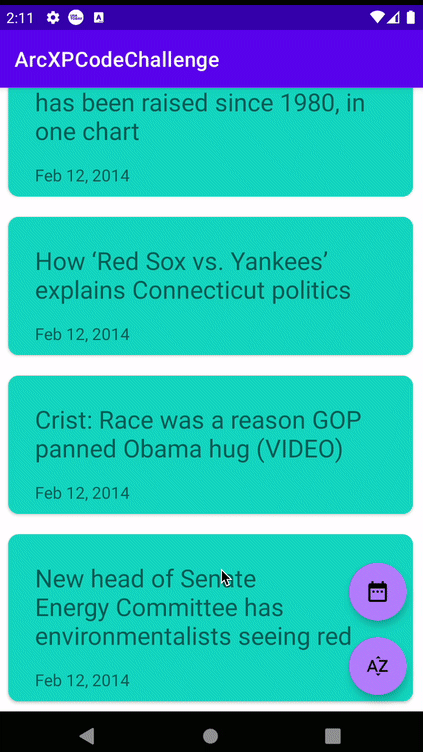

# ArcXP Code Challenge

<<<<<<< Updated upstream

=======

# Main Features
- Information is get from a server (Require Internet Connection).
- User can sort by Title or Date in the home screen.
- Displays detail information once a post is clicked.
- App supports dark-mode

# Architecture
This project is made in Kotlin, and its architecture and folder structure have been inspired in the concepts of clean architecture (the onion diagram) as it shown in the following diagram:

MVVM was choosed here, as the architecture to handle data in the UI.

Also all the navigation shown in the UI is displayed under the a single Activity, using a navigation with Fragments.

# Libraries
This application uses the most common libraries for Android projects:
- Hilt: Is the framework used to manage the dependency injection.
- Retrofit: It allows to define the proper operations to consume the the methods provided by the Api.
- Moshi: It is used to map the json retrieved by the server to data classes.
- Fragment Navigation: This library allows to create a fragment flow with a single activity.

# Author
Alejandro Daniel Jóse Gómez Flórez (@aldajo92)
>>>>>>> Stashed changes
